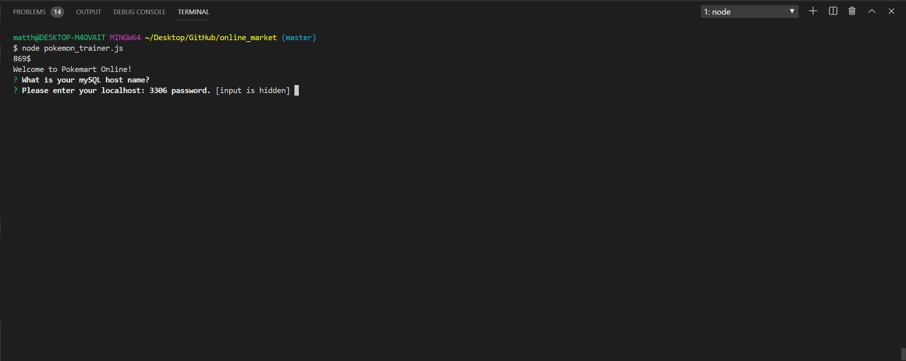
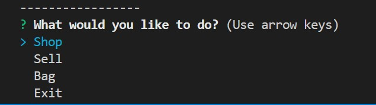
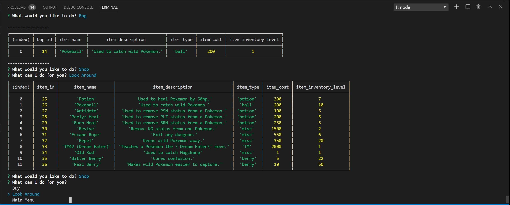
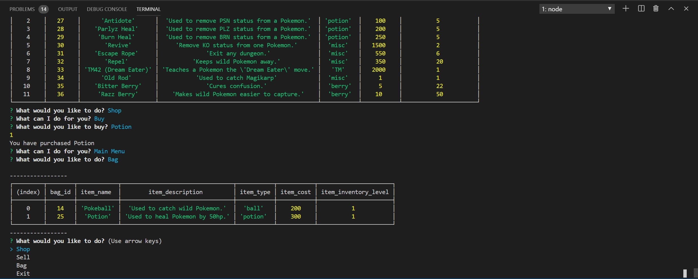
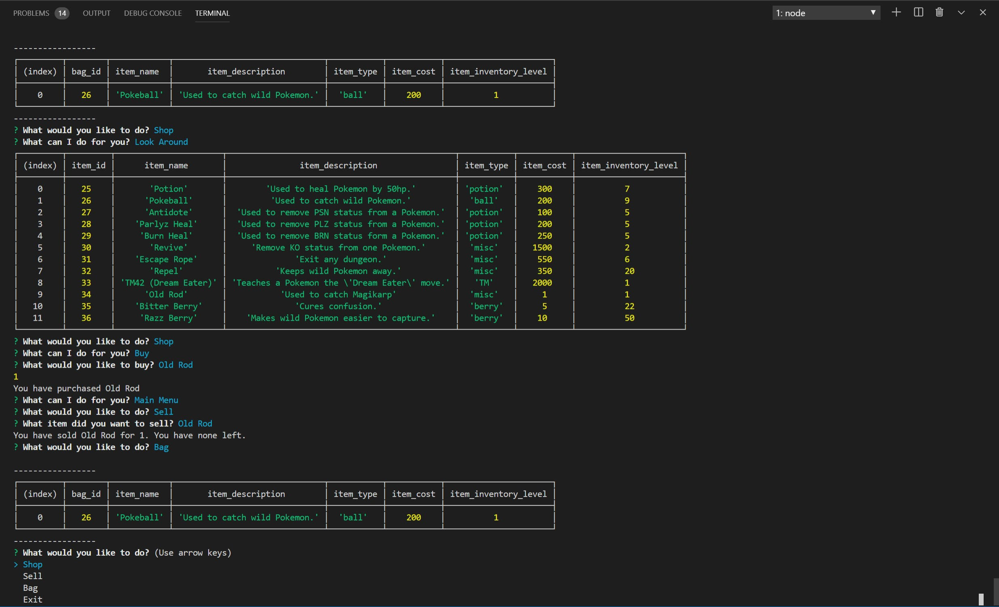

# Pokemart 
 
*by: Matthew Carpenter* 
 
## About 
 
This application demonstrates how you can CREATE, READ, UPDATE, and DELETE content from a SQL server database using Node.js
The theme to this application is based on a popular video game called Pokemon. Using the game's item inventory system this 'console' app gives the user options to choose from that will then have an impact on the inventory *tables* in the *sql* database.  

## Index 
 
[CRUD](#CRUD) 
 
[How to install / run](#How-to-install-/-run) 
 
[SQL Seed Data](#SQL-Seed-Data) 
 
[SQL csv Files](#SQL-csv-Files) 

[How to Play](#How-to-Play)
 
[CREATE](#CREATE) 
  
[READ](#READ) 

[UPDATE](#UPDATE) 
 
[DELETE](#DELETE) 

 
## CRUD
 
Some **highlights** to the CRUD process include. When inventory reaches zero (0) inside the user's `bag` then the table will **delete** the object from the sql database. This is not reflected in the store inventory and will display 

As a user you may select `look around` or `bag` from the `menu` to have the application **read** the content in the sql tables and display them.

When purchasing an item that is not in the user's inventory the application will then **create** a new item object then add it to the bag database.

And finally when selecting an item the user already has in their inventory or selling items back to the Pokemart. The inventory levels will **update** to reflect the new inventory totals. There are two different methods used to accomplish this task.

[Back to top](#)

## How to install / run
 
  1. Download the following applications.  
        * VS CODE 
        * mySQL Workbench 
        * Node.js*
 

  2. Fork [this]() project here and clone the repository to your server/computer.
 

  3. Open mySQL Workbench and create a localhost with root level access.  
      Open the resources folder and copy the content out of the pokemart_seed.sql file. 
       
      *Remember your username and password as the application will request that information before the program is launched.*
 

  4. Paste the content from pokemart_seed.sql file into mySQL Workebench and run it. This will create a database with three tables.
 

  5. Left-click/Option-click the table labeled bag_inventory_table and select **Table Data import Wizard** then select the `Browse...` button and choose the bag_data.csv file. 
       
      Choose `next` 
      Then select the `Use existing table:` radio button at the top then choose `next` 
       
      In the `Dest Column` be sure that the order is as follows 
           * item_name 
           * item_description 
           * item_type 
           * item_cost 
           * item_inventory_level 
       
      Then select `next` *you may choose to Show Logs in the lower left while data is compiled.* 
       
      Select `next` and then select `finished` from the menu. You table should now have the correct starter data.
 

  6. Perform Step:5 this time selecting the shop_inventory_table and the pokemart_data.csv file.
 

  7. You are done with mySQL workbench. Now open **VS Code** and use the `file` menu to `Add folder to Workspace` Select this project's folder at the destination you had installed it.  
       
      *it may be in your downloads folder*
 

  8. Left-click/Option-click the project folder and select `Terminal` to launch a new bash window.
 

  9. From the folder's root level type the following command into terminal 
       
      `npm install` 
       
      *this should install all of the required packages to run the console application on your server.*
 

  10. Once complete then perform the following command.  
       
      `node pokemon_trainer.js` 
       
      This will start he application on your server.
 

  11. The application will request that you provide your sever name and password. Default settings for this are `root` and `password`.
 

  12. Installation and Setup complete!
 
[Back to top](#)

***

## How to Play 


You will be provided the following options
* Shop
    * Buy
        * Items
        * Items
        * Items
    * Look Around
    * Main Menu
* Sell
    * Item(s)
    * Item(s)
    * Item(s)
* Bag
* Exit

Be sure to use your mySQL/database_server id and password to connect.



You can start by checking what is already in your inventory by using the `Bag` menu item.



Or see what item(s) are for sale by selecting the `Look Around` sub-menu item inside of the `Shop` menu.



From here the Pokemart will display if item(s) are sold out or if you can keep buying the.

Purchase and sell back your whole inventory over and over again!

This application is stable and will display when item(s) are out of inventory in the shop.

Or not-disply the items you have run out of in your own inventory.



Have all the fun of shopping in the Pokemon world without having to pick up your DS. Here on Pokemart!



[Back to top](#)

***

## SQL Seed Data
 
This application comes with SQL seed data files. The file content should look like this:

```code
DROP DATABASE IF EXISTS pokemartDB;
CREATE DATABASE pokemartDB;
USE pokemartDB;

CREATE TABLE shop_inventory_table (
    item_id INT NOT NULL AUTO_INCREMENT,
    item_name VARCHAR(64) NOT NULL,
    item_description VARCHAR(256),
    item_type VARCHAR(32),
    item_cost INT NOT NULL,
    item_inventory_level INT NOT NULL,
    PRIMARY KEY (item_id)
);

```
 
## SQL csv Files
This application comes with .csv files (comma separated values) that match the Seed file schema. These files can be edited before installation to fit the server/host needs. See seed file for more details.

```code
Potion, Used to heal Pokemon by 50hp., potion, 300, 7
Pokeball, Used to catch wild Pokemon., ball, 200, 10
``` 

[Back to top](#)
 
## CREATE
 
```javascript

    function addItemToBagDB(){
        connection.query(`INSERT INTO ${bag} (bag_id, item_name, item_description, item_type, item_cost, item_inventory_level) VALUES(${arrayOfObjects})`, function(err, res){
            ...
        };
    };

```
 
## READ
 
```javascript

    function menuBag() {
        connection.query(`SELECT * FROM ${bag}`, function(err, res){
            ...
        };
    };

```

## UPDATE
 
```javascript

    function updateItemInBagDB(){
        connection.query(`UPDATE ${bag} SET item_inventory_level = item_inventory_level + 1 WHERE bag_id = ${item.item_id}`, function(err, res){
            ...
        };
    };

```

## DELETE
 
```javascript

    function menuSell() {
        connection.query(`DELETE FROM ${bag} WHERE bag_id = ${itemObjectInSellQuery.bag_id};`, function(err, res){
            ...
        };
    };

```

## coming soon...

Money: The applicaiton will have the ability to track purchase values and you can run out of money while playing.

Pokemon: In your `mySQL Workbench` you may have noticed the Pokemon_table that will display pokemon.
This will be a part of the pokemon_inventory system that will track what pokemon you have with you
to a max of (6) total pokemon. You will be able to also interact with the Pokemon Bank that was made
by none other than the Pokemon Trainer Bill himeself!

Tune in next time.

[Matthew Carpenter](https://www.linkedin.com/in/matthewcarpenter22)

[Back to top](#)